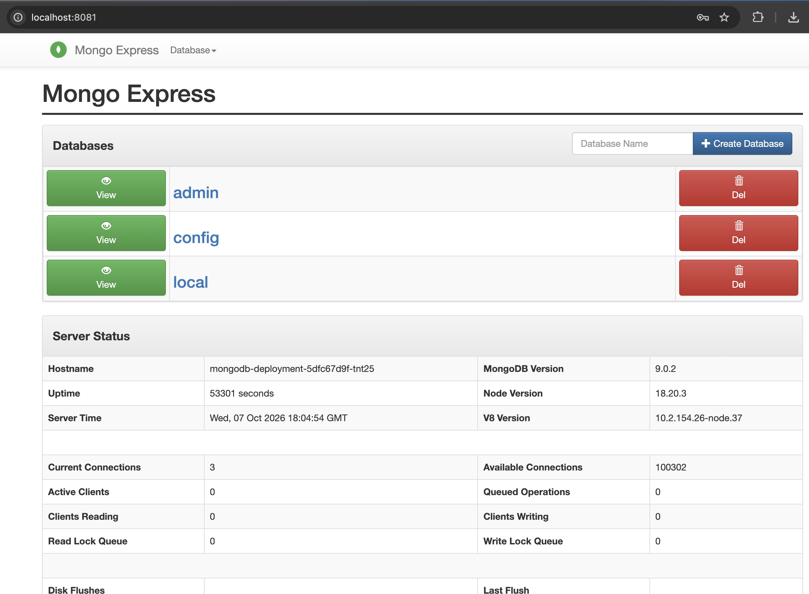

# MongoDB + Mongo Express on Kubernetes (KIND)

A small two-tier Kubernetes project that runs a MongoDB database and the Mongo Express web UI on a local [KIND](https://kind.sigs.k8s.io/) cluster, using declarative YAML manifests.

It demonstrates core Kubernetes building blocks: Deployments, Services (internal and external), Secrets, and ConfigMaps.

## Architecture

```
                         ┌──────────────────────────── KIND cluster ────────────────────────────┐
                         │                                                                      │
  Browser ──────────────►│  mongo-express-service ──► mongo-express pod ──► mongodb-service ──► mongodb pod
  localhost:8081         │  (external, port 8081)      (web UI)             (internal,          (database,
                         │                                                  ClusterIP :27017)   port 27017)
                         │                                                                      │
                         │  mongodb-secret      → root username/password (used by both pods)    │
                         │  mongodb-configmap   → database_url (used by mongo-express)          │
                         └──────────────────────────────────────────────────────────────────────┘
```

| Component | Kind | Purpose |
|---|---|---|
| `mongodb-deployment` | Deployment | Runs the MongoDB pod |
| `mongodb-service` | Service (ClusterIP) | Internal-only access to MongoDB on port 27017 |
| `mongo-express` | Deployment | Web-based admin UI for MongoDB |
| `mongo-express-service` | Service (LoadBalancer, nodePort 30000) | Exposes the UI outside the cluster |
| `mongodb-secret` | Secret | Root username and password |
| `mongodb-configmap` | ConfigMap | MongoDB service hostname (`database_url`) |

## Files

| File | Description |
|---|---|
| `mongo-secret.yaml` | Secret with base64-encoded DB credentials |
| `mongo-configmap.yaml` | ConfigMap holding the DB service name |
| `mongo.yaml` | MongoDB Deployment and internal Service |
| `mongo-express.yaml` | Mongo Express Deployment and external Service |

## Prerequisites

- [Docker](https://docs.docker.com/get-docker/)
- [KIND](https://kind.sigs.k8s.io/docs/user/quick-start/)
- [kubectl](https://kubernetes.io/docs/tasks/tools/)

## Getting started

1. Create the cluster:

   ```bash
   kind create cluster
   ```

2. Apply the manifests. Order matters: the Secret and ConfigMap must exist before the Deployments that reference them.

   ```bash
   kubectl apply -f mongo-secret.yaml
   kubectl apply -f mongo-configmap.yaml
   kubectl apply -f mongo.yaml
   kubectl apply -f mongo-express.yaml
   ```

3. Verify everything is running:

   ```bash
   kubectl get pods
   kubectl get svc
   ```

4. Access Mongo Express locally:

   ```bash
   kubectl port-forward svc/mongo-express-service 8081:8081
   ```

   Then open <http://localhost:8081>.

> **Why port-forward?** KIND runs Kubernetes inside Docker containers, so a `LoadBalancer` Service doesn't get an external IP by default and the node port isn't reachable from the host. `kubectl port-forward` is the simplest way in. Alternatives: map the port with `extraPortMappings` in a KIND config, or install [MetalLB](https://metallb.universe.tf/).

## Cleanup

```bash
kubectl delete -f mongo-express.yaml -f mongo.yaml -f mongo-configmap.yaml -f mongo-secret.yaml
kind delete cluster
```

## Key concepts demonstrated

- **Service discovery:** Mongo Express reaches the database through the DNS name `mongodb-service`, injected via a ConfigMap.
- **Secrets:** credentials are referenced with `secretKeyRef` rather than hardcoded in the Deployments.
- **ConfigMaps:** non-sensitive configuration is kept separate from the pod spec.
- **Internal vs. external exposure:** the database is reachable only inside the cluster; only the UI is exposed.

## Security note

The credentials in `mongo-secret.yaml` are **demo placeholder values** (`username` / `password`). Kubernetes Secrets are base64-encoded, not encrypted. Never commit real credentials to a repository; use a secrets manager or sealed/external secrets in real environments.

## Possible next steps

- Add a PersistentVolume/PersistentVolumeClaim so MongoDB data survives pod restarts
- Pin image versions instead of using `latest`
- Add an Ingress instead of a LoadBalancer Service
- Add resource requests/limits and liveness/readiness probes
- Package the manifests as a Helm chart

## Screenshot

<!--  -->
